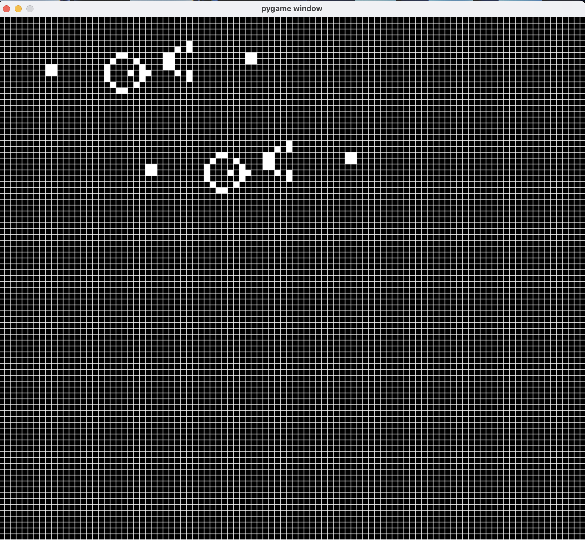
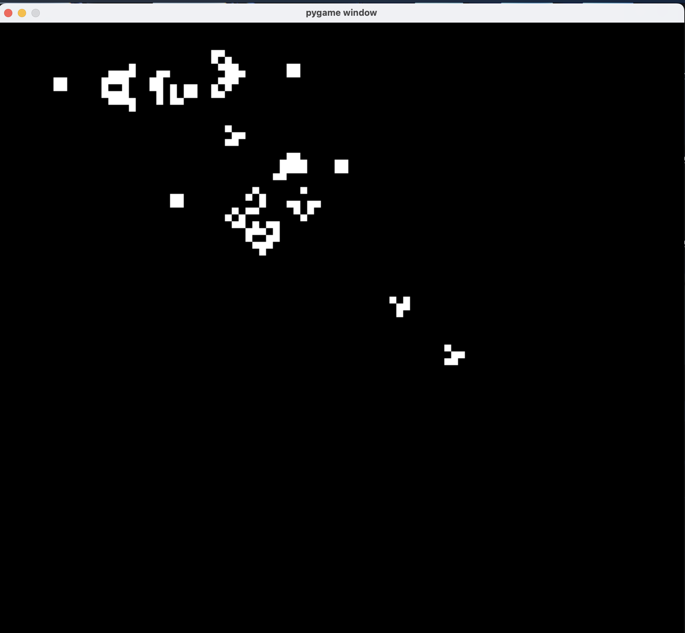

# Game Of Life

<table>
  <tr>
    <td></td>
    <td style="width:1px; background-color:#000;"></td>
    <td></td>
  </tr>
</table>

Game of Life is a cellular automaton [Wikipedia : Game Of Life](https://en.wikipedia.org/wiki/Conway%27s_Game_of_Life). It can create beautiful life-like forms, emerging out of nowhere.

This is my rudimentary implementation of the game. As I look back at some choices, many, many optimizations are possible.

Pygame module is necessary. Then run 

```python
python main.py
```

You can click on cells to activate / deactivate them manually. Press the Esc key to play / pause simulation.
